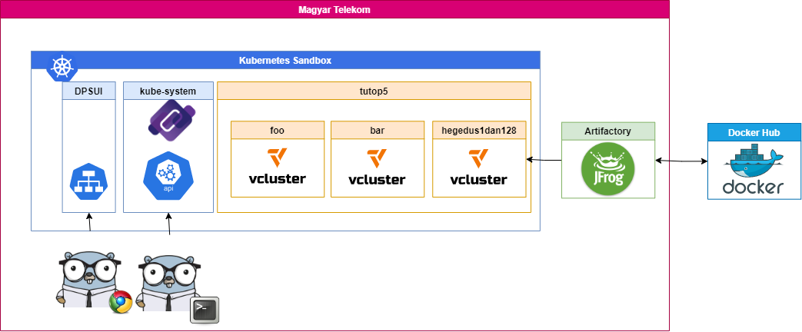

# Bookinfo on vcluster
## About:  
https://www.vcluster.com/docs/what-are-virtual-clusters  
https://www.vcluster.com/docs/quickstart  
https://www.vcluster.com/docs/architecture/basics  
https://istio.io/latest/docs/examples/bookinfo/  

>>WARNING: Prerequisite: Istall some kind of CLI tool, like cywin (click on this link -->)  https://cygwin.com/setup-x86_64.exe

Vcluster Infra Architecture:


Virtual clusters are fully working Kubernetes clusters that run on top of other Kubernetes clusters. Compared to fully separate "real" clusters, virtual clusters reuse worker nodes and networking of the host cluster. They have their own control plane and schedule all workloads into a single namespace of the host cluster. Like virtual machines, virtual clusters partition a single physical cluster into multiple separate ones.
  
The virtual cluster itself only consists of the core Kubernetes components: API server, controller manager, storage backend (such as etcd, sqlite, mysql etc.) and optionally a scheduler.   
To reduce virtual cluster overhead, vcluster builds by default on k3s, which is a fully working, certified, lightweight Kubernetes distribution that compiles the Kubernetes components into a single binary and disables by default all not needed Kubernetes features, such as the pod scheduler or certain controllers.


>>About k3s:  
Lightweight Kubernetes. Easy to install, half the memory, all in a binary of less than 100 MB.  
Great for:  
>> - Edge  
>> - IoT  
>> - CI  
>> - Development  
>> - ARM  
>> - Embedding K8s  
>> - Situations where a PhD in K8s clusterology is infeasible  

# Tools:
### **Terminal:** https://cygwin.com/
### **kubectl** https://kubernetes.io/docs/tasks/tools/install-kubectl-windows/
### **HELM3:** https://helm.sh/docs/intro/install/  
### **VCluster CLI**: https://github.com/loft-sh/vcluster/releases  

In terminal window:
```bash
#Download kubectl 1.22:
curl -LO "https://dl.k8s.io/release/v1.22.0/bin/windows/amd64/kubectl.exe"
#download 3.7.2 helm:
curl -LO "https://get.helm.sh/helm-v3.7.2-windows-amd64.zip"
#unzip and move
unzip helm-v3.7.2-windows-amd64.zip;
mv windows-amd64/helm.exe ./


#download 0.12.0 vclustercli:
curl -LO "https://github.com/loft-sh/vcluster/releases/download/v0.12.0/vcluster-windows-amd64.exe"
#rename it to vcluster.exe
mv vcluster-windows-amd64.exe vcluster.exe;
#Note: by default it will be downloaded to: C:\cygwin64\home\resusername\
```
"
*Dont forget to add to $PATH* (kubectl,helm,vcluster) Computer Restart needed!  
## Without escalated privileges:
```bash
echo -e "\nalias kubectl='${HOME}/kubectl.exe'\nalias helm='${HOME}/helm.exe'\nalias vcluster='${HOME}/vcluster.exe'" >> .bashrc;
#reload bashrc
source ~/.bashrc
#last command needs to be done on every new window.

```
### Set env var under Win:
TLDR: windows key, "A Rendszer környezeti változóinak módosítása" / Környezeti változók  
https://docs.oracle.com/en/database/oracle/machine-learning/oml4r/1.5.1/oread/creating-and-modifying-environment-variables-on-windows.html#GUID-DD6F9982-60D5-48F6-8270-A27EC53807D0

## Check everything works fine:
```bash
# print helm version
helm version
# print vcluster version
vcluster --version
# print kubectl version
$ kubectl version
```

All in action:



## User Sandbox login:
https://k8s-nsxt-sandbox-login.paas.telekom.hu/login


### Connecting and creating new clusters:
```bash
#optional: check helm values
$ cat vcluster.yaml
vcluster:
  image: rancher/k3s:v1.23.5-k3s1

defaultImageRegistry: arti.paas.telekom.hu/docker-remote/
```
```bash
#Connect to tutop5 Virtual Cluster
vcluster connect tutop5 --namespace tutop5
#OR:

#Install our very own vcluster inside tutop5 vcluster
helm upgrade --install hegedus1dan128 vcluster \
  --values vcluster.yaml \
  --repo https://charts.loft.sh \
  --namespace tutop5 \
  --repository-config=''
#then connect to newly created cluster as it show at end of the output.
```
### App install:
Bookinfo Application architecture:

  
```bash
hegedus1dan128@TWN576961 ~/git/bookinfo
$ git clone git@github.com:MT-PaaS/bookinfo.git

#doublecheck if you are in the right Context:
$ k config current-context

#Apply manifest into right NS
kubectl apply -f bookinfo.yaml

service/details created
serviceaccount/bookinfo-details created
deployment.apps/details-v1 created
service/ratings created
serviceaccount/bookinfo-ratings created
deployment.apps/ratings-v1 created
service/reviews created
serviceaccount/bookinfo-reviews created
deployment.apps/reviews-v1 created
deployment.apps/reviews-v2 created
deployment.apps/reviews-v3 created
service/productpage created
serviceaccount/bookinfo-productpage created
deployment.apps/productpage-v1 created
#
#Connect to "Frontend" of our microservices
kubectl port-forward svc/productpage 9080:9080

```
---- PLEASE IGNORE FROM DOWN HERE

## TODO: Istio:

```bash
#https://gitlab.paas.telekom.hu/k8s-infra/istio/istio-test
helm repo add istio https://istio-release.storage.googleapis.com/charts
helm repo add kiali https://kiali.org/helm-charts
helm repo update

kubectl create namespace istio-system

helm install istio-base istio/base -n istio-system
helm install istiod istio/istiod -n istio-system --set global.hub=arti.paas.telekom.hu/docker-remote/istio --set global.proxy.resources.limits.cpu=600m

hegedus1dan128@TWN576961 ~/git/bookinfo
$ helm install --namespace istio-system kiali-operator --wait -f kiali-values.yaml kiali/kiali-operator
#NOTES:
#Welcome to Kiali! For more details on Kiali, see: https://kiali.io
#
#The Kiali Operator [v1.56.1] has been installed in namespace [istio-system]. It will be ready soon.```
kubectl apply -f kiali-cr.yaml
$ k get po 
$ kubectl label ns default istio-injection=enabled
namespace/default labeled

$ k rollout restart deploy
deployment.apps/details-v1 restarted
deployment.apps/ratings-v1 restarted
deployment.apps/reviews-v3 restarted
deployment.apps/reviews-v2 restarted
deployment.apps/reviews-v1 restarted
deployment.apps/productpage-v1 restarted

kubectl port-forward -n istio-system  service/kiali 20001
http://localhost:20001/

TODO: Prometheus missing
$ helm install monitoring prometheus-community/kube-prometheus-stack
Error: INSTALLATION FAILED: failed pre-install: timed out waiting for the condition
```
Prometheus:
helm repo add prometheus-community https://prometheus-community.github.io/helm-charts
helm repo update
helm search repo kube-prometheus-stack -l
kubectl create ns monitoring
helm install monitoring prometheus-community/kube-prometheus-stack


k config current-context
vcluster connect danitop5-student2 --namespace danitop5-student2

### More info:  
https://rancher.com/docs/k3s/latest/en/  
https://helm.sh/  
https://kubernetes.io/docs/reference/kubectl/  
https://landscape.cncf.io/card-mode?category=certified-kubernetes-distribution&grouping=category&selected=vcluster
https://landscape.cncf.io/card-mode?category=certified-kubernetes-distribution&grouping=category&selected=k3s

